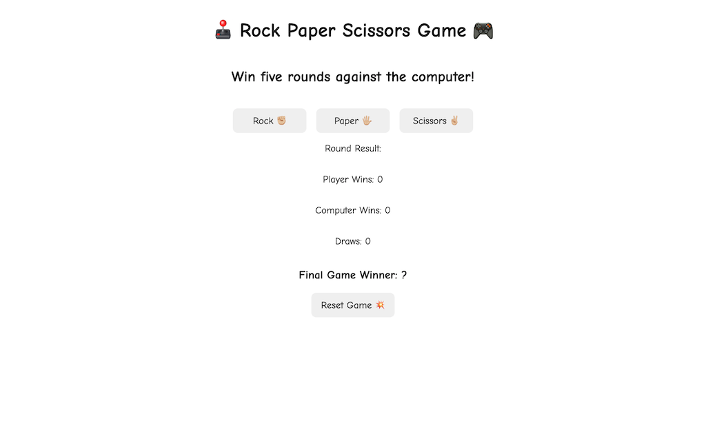

# Rock Paper Scissors

Live demo: https://ts-oh.github.io/RPS/

## Screenshots

**This was a Rock Paper Scissors project from 'The Odin Project' fundamentals.**

## Learning Objective:

  - First phase was to create a console version which was playayble with prompts and outputs to console.
  - In the second phase, UI version was created which was playable through buttons and outputs results using the DOM.

- Used: JavaScript, CSS, and HTML.

## Comments

This is my first project using JS. Some of the concepts I learned to apply to this project was loops, conditionals and DOM manipulation.
